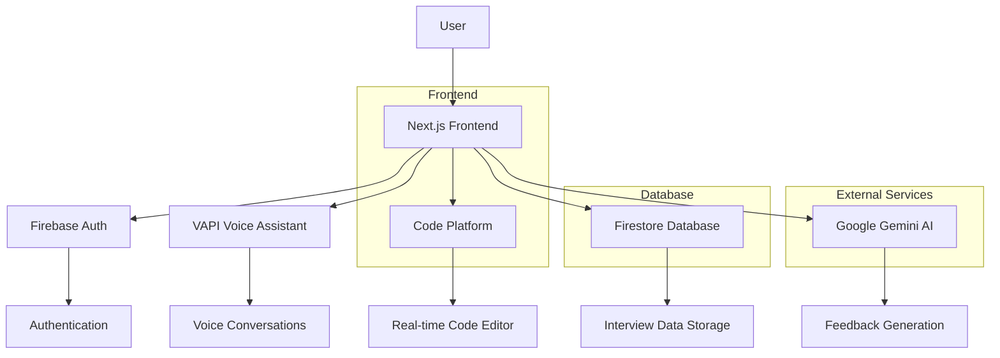

# NeuroSync

**Developer**: Ritesh N  
**Portfolio**: https://riteshn.me/

A modern AI-powered interview platform that simulates real job interviews using voice assistants and provides instant feedback.

## Core Features

- **Multi-Language Coding Platform**: Java, JavaScript, Python, and C language support with real-time compilation
- **Live Voice Interaction**: Real-time voice conversations with AI assistants during interviews
- **Typing Answers with Gemini**: AI-powered text-based interview responses using Google Gemini
- **Instant AI Feedback**: Detailed performance evaluation and suggestions powered by Google Gemini
- **Technical Interview Simulation**: Realistic coding challenges with integrated development environment
- **Voice-Enabled Interviews**: Interactive voice-based questioning and answering
- **Comprehensive Dashboard**: Track and manage all interviews with performance analytics

## Demo Link

Live Demo. play the demo video there

<video width="640" height="360" controls>
  <source src="https://github.com/Ritesh771/Rooman-AI-Interview/raw/main/public/demo-video.mp4" type="video/mp4">
  Your browser does not support the video tag.
</video>

## Tech Stack

- **Frontend**: Next.js, React, TypeScript
- **Styling**: Tailwind CSS, shadcn/ui
- **Backend**: Firebase (Authentication, Firestore)
- **AI Services**: Google Gemini (Feedback Generation)
- **Validation**: Zod
- **Code Platform**: Monaco Editor, WebSocket for real-time collaboration

## Database Architecture

This project now uses Firebase as the sole database backend, replacing SQLite/Prisma entirely. All user data, interview records, and feedback are stored in Firestore.

## Setup

### Prerequisites

- Node.js (v18 or higher)
- npm or yarn
- Firebase account
- Google Gemini API key

### Installation

1. **Clone the repository**
   ```bash
   git clone https://github.com/Ritesh771/Rooman-AI-Interview.git
   cd Rooman-AI-Interview
   ```

2. **Install dependencies**
   ```bash
   npm install
   # or
   yarn install
   ```

3. **Environment Setup**
   Create a `.env.local` file in the root directory and add the following variables:
   ```env
   # NextAuth Configuration
   NEXTAUTH_URL=http://localhost:3000
   NEXTAUTH_SECRET=your_nextauth_secret

   # Google OAuth (for authentication)
   AUTH_GOOGLE_ID=your_google_oauth_client_id
   AUTH_GOOGLE_SECRET=your_google_oauth_client_secret

   # Firebase Configuration
   NEXT_PUBLIC_FIREBASE_API_KEY=your_firebase_api_key
   NEXT_PUBLIC_FIREBASE_AUTH_DOMAIN=your_project.firebaseapp.com
   NEXT_PUBLIC_FIREBASE_PROJECT_ID=your_project_id
   NEXT_PUBLIC_FIREBASE_STORAGE_BUCKET=your_project.appspot.com
   NEXT_PUBLIC_FIREBASE_MESSAGING_SENDER_ID=your_sender_id
   NEXT_PUBLIC_FIREBASE_APP_ID=your_app_id
   NEXT_PUBLIC_FIREBASE_MEASUREMENT_ID=your_measurement_id

   # Firebase Admin (for server-side operations)
   FIREBASE_PROJECT_ID=your_project_id
   FIREBASE_CLIENT_EMAIL=your_firebase_client_email
   FIREBASE_PRIVATE_KEY=your_firebase_private_key

   # VAPI Configuration (for voice features)
   NEXT_PUBLIC_VAPI_TOKEN=your_vapi_api_key

   # Google Gemini Configuration
   GOOGLE_GEMINI_API_KEY=your_gemini_api_key

   # Base URL (optional, for production)
   NEXT_PUBLIC_BASE_URL=http://localhost:3000
   ```

4. **Firebase Setup**
   - Create a Firebase project at [Firebase Console](https://console.firebase.google.com)
   - Enable Authentication with Email/Password and Google providers
   - Set up Firestore Database
   - Generate a service account key for admin operations
   - Copy the config values and service account details to your `.env.local`

5. **Google OAuth Setup**
   - Go to [Google Cloud Console](https://console.cloud.google.com)
   - Create OAuth 2.0 credentials
   - Add authorized redirect URIs: `http://localhost:3000/api/auth/callback/google`
   - Copy client ID and secret to your `.env.local`

6. **Google Gemini Setup**
   - Get API key from [Google AI Studio](https://makersuite.google.com/app/apikey)
   - Add to environment variables

7. **Run the development server**
   ```bash
   npm run dev
   # or
   yarn dev
   ```

8. **Open your browser**
   Navigate to [http://localhost:3000](http://localhost:3000)

## Features & Limitations

### Features

- **User Authentication**: Secure sign-up and sign-in with Firebase
- **AI Interview Creation**: Generate customized interviews using AI
- **Voice-Enabled Interviews**: Real-time voice conversations with AI assistants
- **Instant Feedback**: AI-generated feedback based on interview performance
- **Code Platform**: Integrated coding environment for technical interviews
- **Interview Dashboard**: Track and manage all interviews
- **Responsive Design**: Works on desktop and mobile devices
- **Real-time Collaboration**: WebSocket-based code sharing

### Limitations

- Currently supports only English language interviews
- Voice recognition accuracy depends on internet connection
- Limited to specific tech stacks for coding interviews
- Feedback generation may take a few seconds
- Requires stable internet for voice features

## Architecture Diagram

### Mermaid Diagram



### Architecture Overview

The application follows a modern web architecture with:

- **Frontend Layer**: Next.js handles routing, UI components, and client-side logic
- **Authentication Layer**: Firebase Auth manages user sessions and security
- **Data Layer**: Firestore stores interview data, user profiles, and transcripts
- **AI Layer**: Google Gemini generates intelligent feedback
- **Real-time Layer**: WebSocket connections enable collaborative coding

## Screenshots

### Landing Page


### Authentication


### Dashboard & Interview Management


### Interview Types

#### Voice Interview


#### Coding Interview


#### AI Resume Scoring


### Profile & Resume


## How to Test

### Sample Test Inputs

1. **User Registration**
   - Email: test@example.com
   - Password: TestPass123!

2. **Interview Creation**
   - Job Title: Software Engineer
   - Tech Stack: React, Node.js
   - Experience Level: Mid-level

3. **Voice Interview**
   - Sample Questions:
     - "Tell me about yourself"
     - "What are your strengths?"
     - "Describe a challenging project"

4. **Code Interview**
   - Language: JavaScript
   - Problem: "Write a function to reverse a string"
   - Input: "hello"
   - Expected Output: "olleh"

### Testing Steps

1. Register a new account
2. Create an interview session
3. Test voice interaction (requires microphone)
4. Attempt coding challenges
5. Review generated feedback
6. Check dashboard for interview history

## Potential Improvements & Extensions

### Short-term Improvements

- Add more programming languages support
- Implement interview templates for different roles
- Add progress tracking during interviews
- Improve error handling and user feedback
- Add interview scheduling features

### Long-term Extensions

- Multi-language support for interviews
- Video interview capabilities
- Integration with job boards
- Advanced analytics and reporting
- Mobile app development
- Team collaboration features
- Custom AI model training
- Integration with HR systems

### Technical Enhancements

- Implement caching for better performance
- Add comprehensive testing suite
- Improve accessibility (WCAG compliance)
- Add offline capabilities
- Implement real-time notifications
- Add data export features

## Contributing

1. Fork the repository
2. Create a feature branch (`git checkout -b feature/amazing-feature`)
3. Commit your changes (`git commit -m 'Add amazing feature'`)
4. Push to the branch (`git push origin feature/amazing-feature`)
5. Open a Pull Request

## License

This project is licensed under the MIT License - see the [LICENSE](LICENSE) file for details.

## Contact

For questions or support, please open an issue on GitHub or contact the maintainers.
